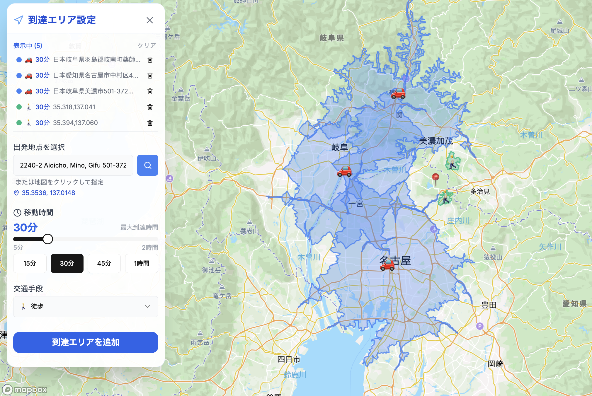

# アイソクロン面マップ



---

## 🚀 デモ

👉 [実際に使ってみる（isochrone-mapping.vercel.app）](https://isochrone-mapping.vercel.app/)

---

## 概要

このアプリは、地図上で指定した出発地点から「○分以内に到達できる範囲（到達圏）」＝**Isochrone（アイソクロン）** を可視化するWebツールです。

- **Isochrone（アイソクロン）とは？**  
  “出発点から一定時間以内に到達できるエリア”を示す線や範囲のことです。  
  例：「駅から徒歩15分圏」「車で30分以内に行けるエリア」など。

- 本アプリは [Mapbox Isochrone API](https://docs.mapbox.com/api/navigation/isochrone/) および  
  [OpenRouteService Isochrone API](https://openrouteservice.org/dev/#/api-docs/v2/isochrones) を利用し、  
  交通手段や時間を指定するだけで自動的にそのエリアを地図上に描画します。

車・徒歩・公共交通機関それぞれの交通手段に対応し、複数の到達圏を重ねて表示することもできます。

- **React (Next.js) & TypeScript**
- **Mapbox API・OpenRouteService APIを利用**
- 日本語インターフェース

---

## 主な機能

- 住所検索または地図クリックで出発地点を指定
- 徒歩・車・公共交通機関を選択可能
- 5〜120分の間で時間を指定して到達圏を追加
- 複数の到達圏を色分け＆アイコン付きで表示
- 各到達圏の削除や一括クリアが可能

---

## セットアップ方法

1. **リポジトリをクローン**

    ```bash
    git clone git@github.com:18gen/isochrone-mapping.git
    cd isochrone-mapping
    ```

2. **依存パッケージのインストール**

    ```bash
    npm install
    ```

3. **APIキーの取得 & 設定**

    - [Mapbox公式サイト](https://account.mapbox.com/) でAPIトークンを発行
    - [OpenRouteService公式サイト](https://openrouteservice.org/sign-up/) でAPIキーを取得

    プロジェクト直下に `.env.local` を作成し、以下を記入

    ```
    NEXT_PUBLIC_MAPBOX_TOKEN=あなたのMapboxトークン
    MAPBOX_ACCESS_TOKEN=あなたのMapboxトークン（同上）
    OPENROUTE_SERVICE_KEY=あなたのOpenRouteServiceキー
    ```

4. **アプリの起動**

    ```bash
    npm run dev
    ```

5. **`http://localhost:3000` にアクセス**

---

## 技術スタック

- Next.js (App Router)
- React 18
- TypeScript
- Mapbox GL JS
- Tailwind CSS
- Mapbox Isochrone API
- OpenRouteService Isochrone API

---

## カスタマイズ例

- アイコンや配色は `/lib/constants.ts` で編集できます
- 独自の交通手段や到達圏ロジックを追加可能

---

## 注意事項

- MapboxトークンやOpenRouteServiceキーは公開リポジトリで**絶対に公開しない**でください
- 商用利用の場合は各APIの利用規約を必ずご確認ください